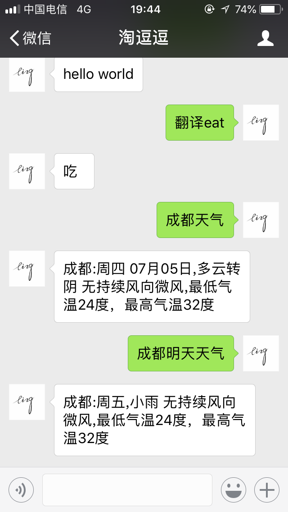
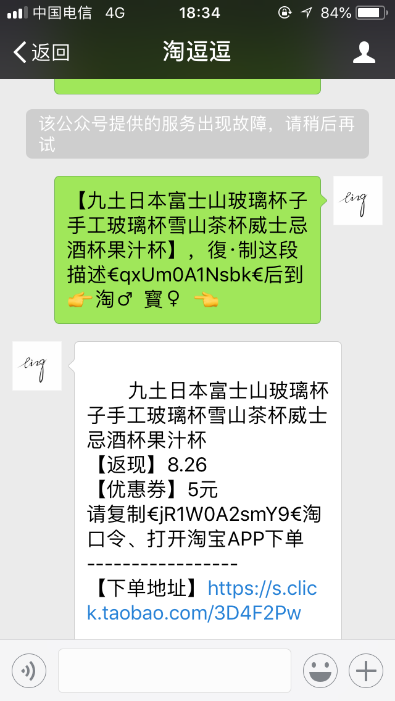

# 订阅号-淘逗逗

<p align="center">
  
</p>

此项目立意是用于学习/了解公众号相关机制，非盈利。

目前公众号内引入的功能:

+ 智能闲聊 -By [腾讯AI-自然语言处理](https://ai.qq.com/doc/nlpchat.shtml)
+ 闲聊/百度/菜谱/搜索/笑话 -By [图灵机器人](http://www.tuling123.com/)
+ 图像美肤/融合/化妆/年龄检测 -By [腾讯AI-计算机视觉](https://ai.qq.com/doc/facecosmetic.shtml)
+ 电影检索(Plugins) -By [torrentkitty](https://www.torrentkitty.tv)
+ 斗图(Plugins)  -By [斗图啦](https://www.doutula.com/apidoc)
+ 淘宝优惠券(Plugins) -By [阿里妈妈](https://www.alimama.com/index.htm), 部分代码借鉴至:[@xsren](https://github.com/xsren/wx_taobao_fanli)
+ VIP视频解析(Plugins) -By [网络资源](https://iodefog.github.io/text/mviplist.json)

# 技术方案:

+ Python2.7 ( With wechatpy + requests + flask )

目前机器人核心代码放在 [bot.py](./bot.py) 下，本质上是调用 腾讯AI 进行瞎聊。

## Command注册机制

一个 Command 即用户输入的一个指令，用于完成一些特定的功能，比如当用户输入 Menu 等，即表示查看菜单。这个类似于关键字回复。

目前的实现方式是: `bot.register_cmd(cmd_name:str, cmd:CommandItem)`。

注册的 Command 总是显示在菜单的最后面, 一个 cmd_name 只能有一个回调函数，重复注册只有最新的会生效。

一个简单的例子如下:

```
import sys

this_module = sys.modules[__name__]
bot = AI('your_app_id', 'your_app_key', your_plugins)
# 注册一个名字叫cmd_name的函数,类型为 CommandItem, 属性见用例
bot.register_cmd('cmd_name',
                 CommandItem(desc='描述此命令做什么的,将会在菜单中展示', re='触发的正则表达式,',
                             method=(this_module, 'hello')))))

# method 即指定触发的回调函数,类型为tuple, 此参数用于getattr(*method), 其格式为(obj, attr, default) 其中default为可选.
cmd = ai.parse_command(msg) # -> 当msg 符合re时返回对应的CommandItem
ai.unregister_cmd('cmd_name') # 取消注册
print cmd

```

## 插件机制

为了更灵活的支持微信的 **关键词自动回复** 功能, 因此也引入了插件机制。
已经写好的插件代码见 `plugins` 目录。

> 某种程度上讲，之前的函数注册机制和目前的插件机制很类似, 但还是有一些区别:
> 1. 插件支持非正则的方式进行匹配，而不仅仅限制于文本消息内容，这一点 Command 无法做到。
> 2. 插件比注册的 Command 优先级更高。只有当插件没有匹配到或者返回为空的情况下，Command 才会有机会进行处理。
> 3. 插件更为灵活，优先级调控 / 自动触发 bootstrap 等。 注册的插件可以在<帮助>中查看，注册的 Command 可以在<Menu>中查看。

一个插件十分简单，只需要实现俩个方法即可:


+ **match(msg: wechatpy.messages.BaseMessage, bot:bot.AI)**
+ **response(msg: wechatpy.messages, bot:bot.AI)**

一个简单的例子参见:[plugins/hello.py](./plugins/hello.py)

```python
# -*- coding:utf-8 -*-


import re

__plugin__ = 'hello_world'
__description__ = '发送hello,回复你好呀'

HELLO_REGEX = re.compile('^hello$', re.I)

# current plugin priority. optional. default is 0
PRIORITY = 10


def match(msg, bot=None):
    return msg.type == 'text' and HELLO_REGEX.match(msg.content)


def response(msg, bot=None):
    return u'你好呀^_^'

```

插件支持优先级。(即当相同规则被多个插件同时满足时优先级较高的可以被处理，从而跳过优先级较低的)。
设置插件的优先级请使用属性 `PRIORITY`, 默认为0。越大越优先。

插件其他特性:

+ 支持使用 `__plugins__` 等 `__description__` 特殊变量用于描述和说明插件功能（当用户查看帮助时可见）
+ 支持 `bootstrap` 即当插件启动时触发的函数,参见 [plugins/help.py](./plugins/help.py)


# 效果截图



